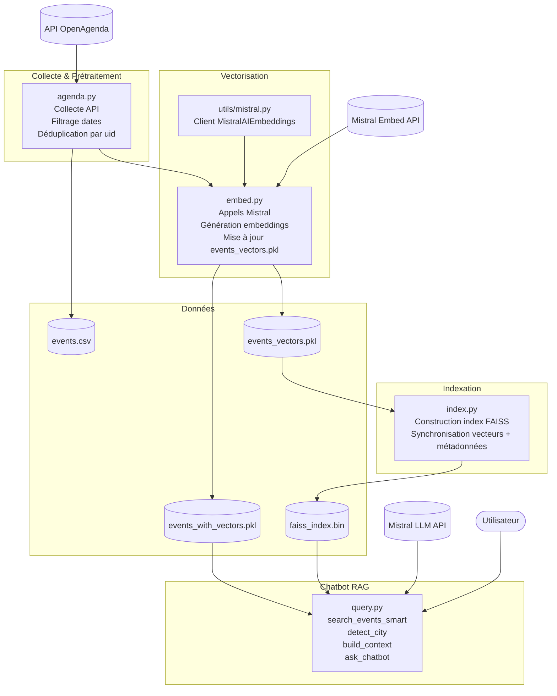

"# Concevez-et-deployez-un-systeme-RAG" 
# Concevoir et déployer un systeme RAG 

## 👤 Auteur

Projet réalisé par **Noel Emmanuel**

* GitHub : https://github.com/Noel974
* LinkedIn : https://www.linkedin.com/in/Antoine-Noel/
* Email : [noelantoine974@outlook.fr](mailto:noelantoine974@outlook.fr)

---

# 📋 Sommaire

* [Introduction](#introduction)
* [Technologies utilisées](#technologies-utilisées)
* [Réalisation](#realisation)

---
Système de **Retrieval-Augmented Generation (RAG)** qui collecte des données d'événements culturels via une API publique, les vectorise, les indexe avec FAISS, puis permet à un utilisateur de poser des questions en langage naturel et d'obtenir des recommandations d'événements générées par un LLM (Mistral) à partir des données réellement trouvées dans la base.

## Introduction 
  Le but est de construire un assistant conversationnel capable de répondre à des questions du type *"Quels concerts y a-t-il à Lyon ce mois-ci ?"* en s'appuyant uniquement sur des événements réels récupérés depuis une API (type OpenAgenda / OpenDataSoft), plutôt que sur les connaissances générales du LLM. C'est le principe du RAG : **on ne laisse pas le modèle inventer, on le force à répondre à partir d'un contexte récupéré (retrieval) dans une base vectorielle.**

## Technologie 

python 
faiss
mistral 
langchain
huggingface

installtation des depance 
```bash
pip install langchain faiss-cpu langchain-mistralai langchain-huggingface sentence-transformers

```

## Réalisation
Le projet fonctionne en 4 étapes séquentielles, chacune correspondant à un script :




1. **`aganda.py`** interroge l'API et sauvegarde les événements bruts dans `data/processed/events.csv`.
2. **`embed.py`** lit ce CSV, calcule un embedding pour chaque nouvel événement, et sauvegarde le tout dans `data/processed/events_vectors.pkl`.
3. **`index.py`** charge ces vecteurs, construit un index FAISS (recherche par similarité) et sauvegarde l'index (`faiss_index.bin`) ainsi que les métadonnées associées (`events_with_vectors.pkl`).
4. **`query.py`** est le chatbot final : il transforme la question de l'utilisateur en vecteur, cherche les événements les plus proches dans FAISS, construit un contexte textuel, puis l'envoie à un LLM Mistral qui rédige la réponse.

Le pipeline est **incrémental** : à chaque exécution de `aganda.py` et `embed.py`, seuls les nouveaux événements (identifiés par leur `uid`) sont ajoutés, sans dupliquer ni retraiter tout l'historique.

### Mise en route 
Création de l'environnement virtuel de pyton 
```bash
python -m venv rag-venv
```
Activation de l'environnement 
```bash
.rag-venv\Scripts\activate
``` 
d'installer les libraries 
pandas — traitement des données

requests — appels API

faiss-cpu — base vectorielle

langchain — orchestration LLM

langchain-mistralai — client Mistral

sentence-transformers — alternative embeddings

pytest — tests unitaires

python-dotenv — gestion des variables d’environnement

installtation des depance 
```bash
pip install pandas requests faiss-cpu langchain langchain-mistralai sentence-transformers python-dotenv pytest

```
ou bien de utiliser requirement.txt 
```bash 
pip install -r requirements.txt

```
#### Deroulement 
Exécuter les scripts **dans l'ordre**, à chaque mise à jour des données :

```bash
# 1. Récupérer les événements (demande une région et une ville en console)
python Script/aganda.py

# 2. Calculer les embeddings des nouveaux événements
python Script/embed.py

# 3. (Re)construire l'index FAISS
python Script/index.py

# 4. Lancer le chatbot
python Script/query.py
```

Exemple d'interaction avec `query.py` :
```
🧑‍💻 Ta question : Quels événements culturels à Lyon?

🤖 Réponse :
D'après les événements disponibles...
```

---

## 3. Description des fichiers

| Fichier | Rôle |
|---|---|
| **`aganda.py`** | Récupère les événements depuis une API (région/ville saisies par l'utilisateur), nettoie les dates, filtre sur une période (`DAYS_HISTORY`, 365 jours par défaut), construit un champ `text_for_embedding` (titre + description + ville + date), et fusionne avec l'historique existant (`data/processed/events.csv`) en supprimant les doublons par `uid`. |
| **`embed.py`** | Charge `events.csv`, compare avec les vecteurs déjà calculés (`events_vectors.pkl`), et n'envoie à l'embedder (`utils/mistral.py` → fonction `embed_texts`) que les événements réellement nouveaux, avant de fusionner et sauvegarder. |
| **`index.py`** | Charge les vecteurs, les empile dans une matrice NumPy, crée un index FAISS de type `IndexFlatL2` (recherche exacte par distance euclidienne) et le sauvegarde avec les métadonnées correspondantes. |
| **`query.py`** | Point d'entrée du chatbot. Charge l'index FAISS et les métadonnées, encode la question utilisateur avec `MistralAIEmbeddings` (`mistral-embed`), récupère les `k=3` événements les plus proches, construit un prompt contextuel, et interroge `ChatMistralAI` (`mistral-large-latest`) pour générer la réponse finale. Boucle interactive en console (`exit` pour quitter). |
| **`test.py`** | Script de vérification de l'environnement : teste les imports (FAISS, LangChain), vérifie si le support GPU FAISS est actif, teste un embedding avec HuggingFace (`all-MiniLM-L6-v2`) et un appel simple à `ChatMistralAI`. **À usage de diagnostic uniquement**, ne fait pas partie du pipeline de production. |
| **`utils/mistral.py`** | Contient la fonction `embed_texts(texts: list[str]) -> list[list[float]]` : instancie `MistralAIEmbeddings("mistral-embed")` et calcule un vecteur pour chaque texte via `embed_query`, appelé en boucle depuis `embed.py`. |

---

### Variables d'environnement (`.env`)
```env
API_BASE_URL=<url_de_l_api_evenements>
DAYS_HISTORY=365
MISTRAL_API_KEY=<votre_clé_api_mistral>
```

> ⚠️ **Important** : ne jamais coder une clé API en dur dans le code source (voir `test.py` actuellement). Utilisez systématiquement `os.getenv(...)`, et régénérez toute clé qui aurait été exposée par erreur.
 
## 4. Test
**Tests unitaires**
Le projet inclut un ensemble de tests automatisés permettant de vérifier la cohérence, la fraîcheur et la qualité des données ainsi que le bon fonctionnement du pipeline RAG.

Lancer tous les tests :

```bash
$env:TEST_REGION="Saint-Denis"; pytest -v

```

**Structure des tests**
tests/
│
├── test_context.py
├── test_embeddings.py
├── test_faiss.py
├── test_ingestion.py
├── test_metadata.py
├── test_rag_data.py
└── test_search.py

**Description détaillée des tests**
`test_context.py`
Vérifie que la fonction build_context() construit correctement le contexte envoyé au LLM :

structure correcte (titre, ville, dates, description, mots‑clés),

absence de champs manquants,

format propre et exploitable.

> Garantit que le LLM reçoit un contexte fiable.

`test_embeddings.py`
Tests liés à la vectorisation :

test_embeddings_file_exists → vérifie que events_vectors.pkl existe,

test_embeddings_has_vectors → vérifie que des vecteurs sont présents,

test_embeddings_vector_format → vérifie que les vecteurs sont bien des listes de floats.

Garantit que les embeddings Mistral sont correctement générés et stockés.

`test_faiss.py`
Tests liés à l’index FAISS :

test_faiss_index_exists → vérifie que faiss_index.bin existe,

test_faiss_index_load → vérifie que l’index peut être chargé sans erreur.

> Garantit que la base vectorielle est opérationnelle.

`test_ingestion.py`
Tests liés au script d’ingestion agenda.py :

test_ingestion_file_exists → vérifie que events.csv existe,

test_ingestion_has_rows → vérifie qu’il contient des événements,

test_ingestion_uid_present → vérifie que chaque événement possède un uid,

test_ingestion_text_for_embedding → vérifie que text_for_embedding est bien généré.

> Garantit que les données sont propres, complètes et prêtes pour la vectorisation.

`test_metadata.py` 
Vérifie la cohérence entre :

les vecteurs FAISS,

les métadonnées events_with_vectors.pkl.

Test principal :

test_metadata_consistency

> Garantit que FAISS et les métadonnées sont parfaitement synchronisés.

`test_rag_data.py` 
Tests métier du chatbot RAG :

test_detect_city_finds_known_city → la ville est correctement détectée,

test_detect_city_returns_none_when_no_city_mentioned → pas d’hallucination de ville,

test_search_smart_filters_strictly_on_detected_city → filtrage strict par ville,

test_search_smart_results_are_recent → les résultats sont récents (< DAYS_HISTORY),

test_search_smart_without_city_does_not_crash → robustesse si aucune ville n’est détectée.

> Garantit que le chatbot respecte les règles métier du projet.

`test_search.py` 
Tests de la recherche vectorielle :

test_search_faiss → vérifie que FAISS retourne bien des résultats valides.

> Garantit que la recherche sémantique fonctionne correctement.